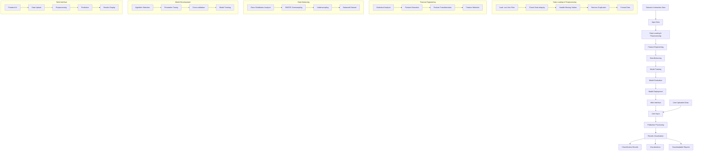

# Genomic Interaction Classification System - Input-Output Flow Diagram

## How to Read This Diagram

This diagram shows how our genomic interaction classification system works, from start to finish. Think of it like a map showing how data moves through our system.

### Simple Guide to Understanding the Flow:

1. **Start at the Top**
   - The diagram flows from top to bottom
   - Data enters at the top and moves down through different stages

2. **Follow the Arrows**
   - Arrows (→) show how data moves from one step to the next
   - Each arrow represents a transformation or processing step

3. **Main Sections (Left to Right)**
   - **Data Collection**: Where we get our information
   - **Data Cleaning**: Making the data ready for use
   - **Model Building**: Creating our prediction system
   - **Web Interface**: How users interact with the system
   - **Results**: What users get at the end

4. **Color-Coded Boxes**
   - Each colored box represents a different process
   - Connected boxes show related steps

5. **Subprocesses**
   - Smaller boxes inside main boxes show detailed steps
   - These explain what happens within each main process

### Quick Reference:

- **Input**: Where data enters the system
- **Processing**: How we prepare the data
- **Model**: Our prediction system
- **Interface**: How users interact
- **Output**: Final results users receive

## Flow Description

1. **Input Layer**
   - Initial genomic interaction data (81,203 interactions)
   - User-uploaded data through web interface

2. **Data Processing Layer**
   - Data loading and preprocessing
   - Feature engineering and transformation
   - Data balancing using SMOTE and undersampling

3. **Model Development Layer**
   - Random Forest model training
   - Hyperparameter tuning
   - Cross-validation and evaluation

4. **Web Interface Layer**
   - User-friendly interface for data upload
   - Real-time prediction processing
   - Interactive results visualization

5. **Output Layer**
   - Classification results
   - Interactive visualizations
   - Downloadable reports

## Key Components

- **Data Processing**: Ensures data quality and prepares features for modeling
- **Model Development**: Implements and optimizes the Random Forest classifier
- **Web Interface**: Provides easy access to the classification system
- **Results**: Delivers comprehensive and interpretable outputs

## Data Flow

1. Raw data → Preprocessed data
2. Preprocessed data → Feature-engineered data
3. Feature-engineered data → Balanced dataset
4. Balanced dataset → Trained model
5. User input → Processed prediction
6. Processed prediction → Visualized results 