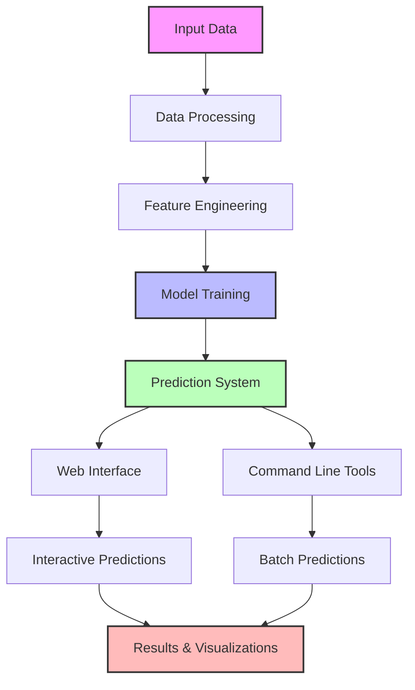

# Project Flow Explanation

## 1. Input Data
- Genomic interactions dataset
- Features like supporting pairs, distances, and interaction types

## 2. Data Processing
- Data cleaning and preprocessing
- Handling missing values
- Data normalization

## 3. Feature Engineering
- Creating relevant features
- Feature selection
- Feature scaling

## 4. Model Training
- Random Forest model training
- Model validation
- Performance evaluation

## 5. Prediction System
- Two interfaces:
  - Web Application
  - Command Line Tools

## 6. Results & Visualizations
- Prediction outputs
- Statistical analysis
- Visual representations
- Performance metrics 